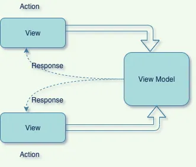

# Carrer Craft with mvvm architecture

## MVVM is useful to move business logic from view to ViewModel and Model. ViewModel is the mediator between View and Model which carry all user events and return back the result.

